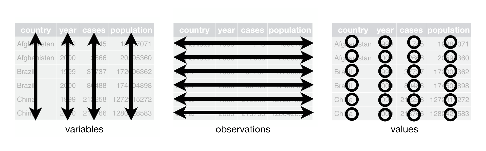
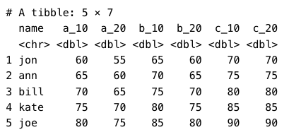
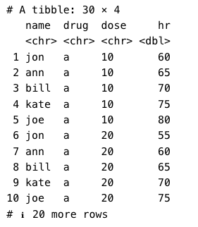
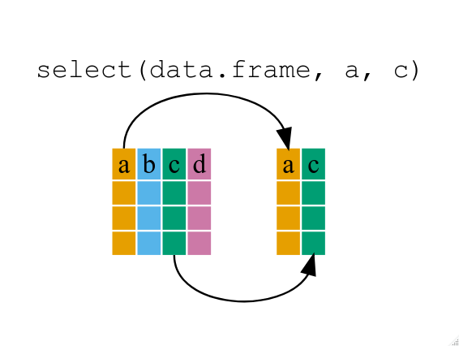
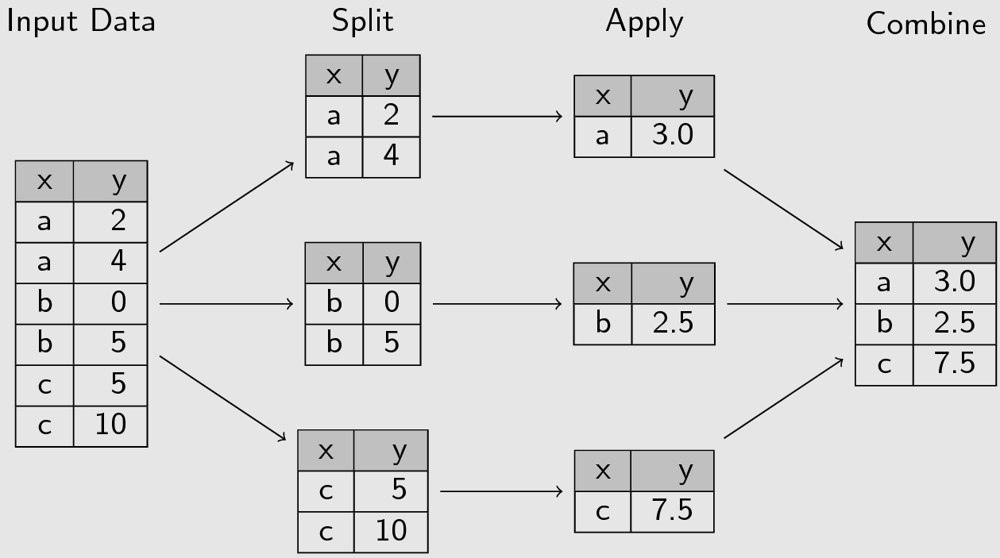
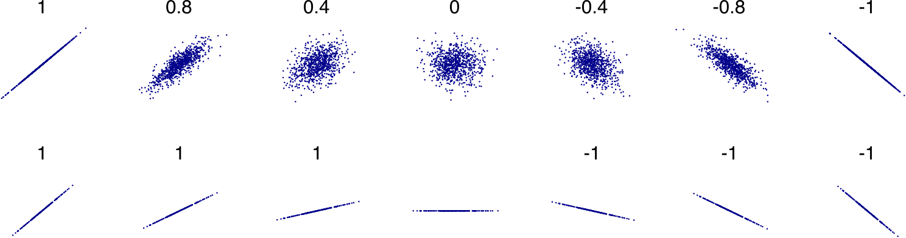

```{r}
#| label: Libraries
#| message: false
#| warning: false
#| include: false
library(tidyverse)
library(janitor)
library(palmerpenguins)
library(rstatix)
library(ggpubr)
library(knitr)
theme_set(theme_classic())
```


# Tidyverse and data exploration

## Structuring data
Spreadsheet example:


::: {.notes}
This spreadsheet has a fairly strict organisational structure, but is virtually hopeless for doing any kind of serious statistical analysis. It’s also verging on irreparable using R. This because the data in this spreadsheet is organised to be easy to look at with your eyeballs.
:::

## Follow these rules

1. The first row of the data _must_ be the names of the data columns.
2. All other rows _must_ be the data, and nothing else.
3. You cannot use empty rows or empty columns as visual aids to look at the data.
4. Do not use colour or other formatting to indicate information.
5. The spreadsheet must not contain any summary cells.

## Tidy tables
::: {.notes}
You can represent the same underlying data in multiple ways, but they are not equally easy to use. There is one approach that makes it easier to work with "tidy tables".
:::
There are three interrelated rules that make a dataset tidy:

1. Each variable is a column; each column is a variable.
2. Each observation is a row; each row is an observation.
3. Each value is a cell; each cell is a single value.



## Why ensure that your data is tidy? 
There are two main advantages:

- There’s a general advantage to picking one consistent way of storing data. If you have a consistent data structure, it’s easier to learn the tools that work with it because they have an underlying uniformity.
- There’s a specific advantage to placing variables in columns because it allows R’s vectorized nature to shine. That makes transforming tidy data feel particularly natural.

## Example
:::: {.columns}

::: {.column width="50%"}
Untidy table


:::

::: {.column width="50%"}
Tidy table


:::

::::

::: {.notes}
This is some made-up data for five different patients (Jon, Ann, Bill, Kate, and Joe) given three different drugs (A, B, and C), at two doses (10 and 20), and measuring their heart rate.
:::

## Exploratory Data Analysis (EDA)
Exploratory data analysis is an approach of analysing data sets to summarise their main characteristics. It is the first thing you should do with any data set you have access to, and R has a few functions to make this easier.

## The Iris data set


::: {.notes}
- The Iris flower data set or Fisher's Iris data set is a multivariate data set used and made famous by the British statistician and biologist Ronald Fisher in a 1936 paper.
:::

- 50 samples from each of three species of Iris
  - Iris setosa
  - Iris virginica
  - Iris versicolor
-  Four features were measured from each sample: the length and the width of the sepals and petals, in centimeters.

## `summary()`

When `summary()` is applied to a data frame it produce some simple summary statistics of all the columns.

::: {.notes}
- For continuous variables it provides minimum, maximum, median, mean, and quartiles values, as well as any missing data.
- For factors it provides the count of each factor and the number of missing values.
:::

```{r}
summary(iris)
```

## glimpse()

`glimpse()` provides a peak at your data. For each column, it provides the type of variable and the first few values. It is in an easy to read format for even large data frames with each row being a different column.

```{r}
glimpse(iris)
```

## skimr
`skimr` provides a frictionless approach to summary statistics which conforms to the [principle of least surprise](https://en.wikipedia.org/wiki/Principle_of_least_astonishment), displaying summary statistics the user can skim quickly to understand their data.

- Provides a larger set of statistics than `summary()`, including missing, complete, n, and sd.
- reports each data types separately
- handles dates, logicals, and a variety of other types
- supports console text graphs

::: {style="font-size: 45%;"}
## 
```{r}
library(skimr)
skim(iris)
```
:::

## Exercise Answers 1
```{r}
summary(penguins)
```
## Exercise Answers 2
```{r}
glimpse(penguins)
```
## Exercise Answers 3
::: {style="font-size: 35%;"}
```{r}
skim(penguins)
```
:::

## Data Manipulation with dplyr
The `dplyr` package gives you a handful of useful **verbs** for managing data. What they have in common:

1. The first argument is always a data frame.
2. The subsequent arguments typically describe which columns to operate on using the variable names (without quotes).
3. The output is always a new data frame.

## Brauer et al. (2008) dataset

::: {.notes}
The data we’re going to look at is cleaned up version of a gene expression dataset from [Brauer et al. Coordination of Growth Rate, Cell Cycle, Stress Response, and Metabolic Activity in Yeast (2008) _Mol Biol Cell_ 19:352-367](http://www.ncbi.nlm.nih.gov/pubmed/17959824) - `bauer`. This data is from a gene expression microarray, and in this paper the authors are examining the relationship between growth rate and gene expression in yeast cultures limited by one of six different nutrients (glucose, leucine, ammonium, sulfate, phosphate, uracil).
:::

```{r}
#| echo: false
#| message: false
#| warning: false
brauer <- read_csv("data/brauer2007_tidy.csv")
glimpse(brauer)
```


## `filter()`
If you want to filter **rows** of the data where some condition is true, use the `filter()` function.

1. The first argument is the data frame you want to filter, e.g. `filter(mydata, ...`.
2. The second argument is a condition you must satisfy, e.g. `filter(ydat, symbol == "LEU1")`. 

## Conditions
- `==`: Equal to
- `!=`: Not equal to
- `>`, `>=`: Greater than, greater than or equal to
- `<`, `<=`: Less than, less than or equal to

**“and” operator `&`** - satisfy _all_ of multiple conditions.

**“or” operator `|`** - meet _any_ of the multiple conditions.

## `filter()` example 1
```{r}
# Look at a single gene involved in leucine synthesis pathway
filter(brauer, symbol == "LEU1")
```

## `filter()` example 2
```{r}
# Look at multiple genes
filter(brauer, symbol=="LEU1" | symbol=="ADH2")
```

## `filter()` example 3
```{r}
# Look at LEU1 expression at a low growth rate due to nutrient depletion
# Notice how LEU1 is highly upregulated when leucine is depleted!
filter(brauer, symbol=="LEU1" & rate==.05)
```

## `arrange()`
- The `arrange()` function takes a data frame and arranges (or sorts) by column(s) of interest. 
- The first argument is the data, and subsequent arguments are columns to sort on. 
- Use the `desc()` function to arrange by descending.

## `arrange()` example 1
```{r}
# arrange by expression (default: increasing)
arrange(brauer, expression)
```
## `arrange()` example 2
```{r}
# arrange by decreasing expression
arrange(brauer, desc(expression))
```

## Exercise Answer 1
```{r}
library(tidyverse)
brauer <- read_csv(file="data/brauer2007_tidy.csv") 

#1
filter(brauer, bp == "leucine biosynthesis" & nutrient == "Leucine")
```
## Exercise Answer 2
```{r}
#2
arrange(filter(brauer, bp == "leucine biosynthesis" & nutrient == "Leucine"), symbol)
```

## `select()`
::: {.notes}
The `filter()` function allows you to return only certain _rows_ matching a condition. 
:::
- The `select()` function returns only certain _columns_. 
- The first argument is the data, and subsequent arguments are the columns you want.



## `select()` example 1
```{r}
# Select just the symbol and systematic_name
select(brauer, symbol, systematic_name)
```
## `select()` example 2
```{r}
# Alternatively, just remove columns. Remove the bp and mf columns.
select(brauer, -bp, -mf)
```

## `select()` example 3
These functions do not change the original data. You need to assign the results to another variable if you want to keep them.

```{r}
# create a new dataset without the go annotations.
nogo <- select(brauer, -bp, -mf)
nogo
```

## `mutate()`
The `mutate()` function adds new columns to the data based on other columns.

::: {.notes}
The expression level reported here is the $log_2$ of the sample signal divided by the signal in the reference channel, where the reference RNA for all samples was taken from the glucose-limited chemostat grown at a dilution rate of $0.25 h^{−1}$. Let’s mutate this data to add a new variable called “signal” that’s the actual raw signal ratio instead of the log-transformed signal. Let’s make another column that’s the square root of the signal ratio.
:::
```{r}
mutate(nogo, signal=2^expression, sigsr=sqrt(signal))
```


## Pipe `|>`

`|>` is super cool and lets you _pipe_ the output of one function to the input of another, so you can avoid nesting functions.

```default
tail(brauer, 5)
brauer |> tail(5)
```

## With pipe 
When there are multiple functions, it’s easy to skim because the verbs come at the start of each line.

For example:

```default
flights |> 
  filter(dest == "IAH") |> 
  mutate(speed = distance / air_time * 60) |> 
  select(year:day, dep_time, carrier, flight, speed) |> 
  arrange(desc(speed))
```
## Without pipe 
Start with the `flights` data, then filter, then mutate, then select, then arrange. Compare with:
```default
arrange(
  select(
    mutate(
      filter(
        flights, 
        dest == "IAH"
      ),
      speed = distance / air_time * 60
    ),
    year:day, dep_time, carrier, flight, speed
  ),
  desc(speed)
)
```

## Exercise answer 1
```{r}
library(tidyverse)
brauer <- read_csv(file="data/brauer2007_tidy.csv")

#1
brauer |> 
  filter(symbol == "ADH2" & rate == 0.05) |>
  select(nutrient, expression)
```

## Exercise answer 2
```{r}
#2
brauer |> 
  filter(rate == 0.05 & nutrient == "Glucose") |>
  select(symbol, expression, mf, bp) |>
  arrange(desc(expression))
```

## Data cleaning extra functions
::: {.notes}
The above processes can be very useful to clean up a dataset and get it the way that you want. Other useful functions:
:::

- `rename()` - changes the names of individual variables using `new_name = old_name` syntax .
- `drop_na(col)` - detects whether there is a missing value.
- `drop_na()` - removes any rows of a data frame that contain an NA in any column.
- `distinct(cols, .keep_all = TRUE)` - Keep only unique/distinct rows from a data frame.

## Manipulating Groups
Split-apply-combine is a very common data analysis pattern.

::: {.notes}
You see the split-apply-combine strategy whenever you break up a big problem into manageable pieces, operate on each piece independently and then put all the pieces back together.
:::



## Manipulating Groups in R
This pattern is performed in R using `dplyr`'s `group_by` and `summarise()` functions.

```
data |>
group_by(col1) |>
summarise(mean_col2 = mean(col2))
```


## Exercise Answer 1
```{r}
library(tidyverse)
brauer <- read_csv(file="data/brauer2007_tidy.csv")

#1
brauer |> filter(rate == 0.05 & bp == "response to stress") |>
  group_by(nutrient) |>
  summarise(mean_expr = mean(expression, na.rm = TRUE))
```
## Exercise Answer 2
```{r}
#2
brauer |> filter(rate == 0.05 & bp == "protein biosynthesis") |>
  group_by(nutrient) |>
  summarise(mean_expr = mean(expression, na.rm = TRUE))
```

# Statistics basics
## GGplot2 reminder
ggplot2 is built on the grammar of graphics, the idea that any plot can be built from the same set of components: a **data set**, **mapping aesthetics**, and graphical **layers**:

- **Data sets** are the data that you, the user, provide.
- **Mapping aesthetics** are what connect the data to the graphics. 

::: {.notes}
They tell ggplot2 how to use your data to affect how the graph looks, such as changing what is plotted on the X or Y axis, or the size or color of different data points.
:::
- **Layers** are the actual graphical output from ggplot2.

::: {.notes}
Layers determine what kinds of plot are shown (scatterplot, histogram, etc.), the coordinate system used (rectangular, polar, others), and other important aspects of the plot. The idea of layers of graphics may be familiar to you if you have used image editing programs like Photoshop, Illustrator, or Inkscape.
:::

## ggplot2 example
::: {style="font-size: 90%;"}
```{r}
library(datasets)
data(iris)
ggplot(data = iris, mapping = aes(x=Species, y=Petal.Width, colour = Species))
```
:::
## ggplot2 example
::: {style="font-size: 90%;"}
```{r}
ggplot(data = iris, mapping = aes(x=Species, y=Petal.Width, colour = Species)) +
	geom_boxplot()
```
:::
## ggplot2 example
::: {style="font-size: 90%;"}
```{r}
ggplot(data = iris, mapping = aes(x=Species, y=Petal.Width, colour = Species)) +
	geom_boxplot() + 
	geom_jitter()
```
:::

## Descriptive statistics of a single variable

- Descriptive statistics refers to **the act of describing and summarising data**. 
- This can be done using tables, plots, charts and key descriptive values such as the size of the dataset, percentages, average values and measures of spread.
- A lot of the descriptive statistics can be gained quickly using the Exploratory Data Analysis functions i.e. `summary()` and `skim()`.

## Descriptive statistics - Continuous variables
- `mean(x)` - The arithmetic mean of the values in _x_ is computed.
- `sd(x)` - computes the standard deviation of the values in _x_.
- `median(x)` - computes the median average of the values in _x_. 
- `IQR(x)` - calculates the interquartile range of the values in _x_.

## Descriptive statistics - Continuous variables - Example
```{r}
iris |> pull(Petal.Length) |> mean(na.rm=TRUE)
iris |> pull(Petal.Length) |> sd(na.rm=TRUE)
iris |> pull(Petal.Length) |> median(na.rm=TRUE)
iris |> pull(Petal.Length) |> IQR(na.rm=TRUE)
```

## Descriptive statistics - Continuous variables - Plot
:::{.notes}
It can also be useful to plot the distribution of a continuous variable using a histogram or density plot.
:::

:::: {.columns}

::: {.column width="50%"}
```{r}
#| message: false
#| warning: false
ggplot(iris, aes(x=Petal.Length)) +
  geom_histogram()
```
:::

::: {.column width="50%"}
```{r}
ggplot(iris, aes(x=Petal.Length)) +
  geom_density()
```
:::
::::

## Descriptive statistics - Categorical variables i.e. factors

For categorical variables you would summarise by counting the number in each category.

```default
> penguins |> count(island)

     island   n
1    Biscoe 168
2     Dream 124
3 Torgersen  52
```

## Descriptive statistics - Categorical variables i.e. factors
This can be visualised using a barplot.

```{r}
ggplot(penguins, aes(x = island, fill = island)) + geom_bar()
```

## Exercise Answer 1
```{r}
library(tidyverse)
library(palmerpenguins)

#1
penguins |> count(species)
```
## Exercise Answer 2
```{r}
#2
ggplot(penguins, aes(x = species, fill = species)) + geom_bar()
```
## Exercise Answer 3
```{r}
#3
penguins |> pull(bill_depth_mm) |> mean(na.rm = TRUE)
penguins |> pull(bill_depth_mm) |> sd(na.rm = TRUE)
```
## Exercise Answer 4
```{r}
#4
penguins |> pull(bill_length_mm) |> median(na.rm = TRUE)
penguins |> pull(bill_length_mm) |> IQR(na.rm = TRUE)
```
## Exercise Answer 5
```{r}
#5
ggplot(penguins, aes(x = body_mass_g)) + geom_histogram()
```

## For a continuous variable are the average values of two groups different?

One of the most common questions that researchers ask is, “Do we have evidence that the average value of a trait in one group differs from the average for another group?”.

## *t*-tests
This is the most commonly used approach.

### Assumptions

- The data are continuous.
- The sample data have been randomly sampled from a population.
- The distribution is approximately normal.

## *t*-test Example
::: {style="font-size: 90%;"}
```{r}
# Preparing a suitable dataset
peng_means <- penguins |> 
  filter(species %in% c("Adelie","Gentoo") & !is.na(bill_depth_mm)) |>
  mutate(species = factor(species))

ttest_res <- t.test(bill_depth_mm ~ species, data = peng_means)

print(ttest_res)
print(ttest_res$p.value)
```
:::
## *t*-test Example
```{r}
library(rstatix)
library(ggpubr)

ttest_res <- peng_means |>t_test(bill_depth_mm ~ species) |> 
  add_xy_position()

ggplot(peng_means, aes(x = species, y = bill_depth_mm)) + geom_boxplot() +
	stat_pvalue_manual(ttest_res)
```
## *t*-test Example
```{r}
ttest_res <- peng_means |> 
  t_test(bill_depth_mm ~ species) |> 
  add_xy_position() |> add_significance()

ggplot(peng_means, aes(x = species, y = bill_depth_mm)) + geom_boxplot() +
	stat_pvalue_manual(ttest_res, label = "p.signif")
```

:::{.notes}
By default R uses the Welch two-sample *t*-test rather than Student's two sample *t*-test. This is a good idea as it means we don't have to assume that the variability of the data in each group is similar.
:::

## Testing the distribution is approximately normal - histogram
::: {.notes}
There are two main approaches to testing the normal distribution: visual examination through plots and normality tests.
:::

```{r}
#| message: false
#| warning: false
ggplot(penguins |> filter(species == "Gentoo"), aes(x=bill_depth_mm)) + 
  geom_histogram()
```

## Testing the distribution is approximately normal - QQ plot
::: {.notes}
A QQ plot, or Quantile-Quantile plot, is a graphical tool used to assess whether a dataset follows a specific theoretical distribution, often a normal distribution. It does this by plotting the quantiles of the observed data against the quantiles of the theoretical distribution.
:::
```{r}
#| message: false
#| warning: false
ggplot(penguins |> filter(species == "Gentoo"), aes(sample=body_mass_g)) + 
  geom_qq() + 
  geom_qq_line()
```

## Testing the distribution is approximately normal - Shapiro-Wilk test
::: {.notes}
The most common statistical test for normality is the Shapiro-Wilk test. The Shapiro-Wilk test is a goodness-of-fit whose null hypothesis is that the sample has been generated from a normal distribution. Therefore if _p_ < 0.05, the distribution is thought to be not normal.
:::
```{r}
test_col <- penguins |> filter(species == "Gentoo") |> pull(body_mass_g)
shapiro.test(test_col)
```

## Mann-Whitney U test

What do you do if the distribution of values doesn't follow a normal distribution? 

1. Transform the data so it is normally distributed e.g. $log$ transformation.
2. You use a non-parametric tests i.e. a statistical methods that don't assume a specific distribution for the data.

The Mann-Whitney U Test, also known as the Wilcoxon Rank Sum Test, is a non-parametric statistical test used to compare the medians of two groups.

## Mann-Whitney U Test Example

```{r}
wilcox.test(bill_depth_mm ~ species, data = peng_means)
```

## Mann-Whitney U Test Example Plot
```{r}
wilcox_res <- peng_means |> wilcox_test(bill_depth_mm ~ species) |>
  add_xy_position()

ggplot(peng_means, aes(x = species, y = bill_depth_mm)) + geom_boxplot() +
	stat_pvalue_manual(wilcox_res)
```

## Exercise Answers
```{r}
#| message: false
#| warning: false
library(tidyverse)
library(rstatix)
library(ggpubr)
dat_16S <- read_csv("data/Arcanobacterium_16S.csv")

#1
t.test(Arcanobacterium ~ primaryCat, dat = dat_16S)
```
## Exercise Answers
```{r}
#2
ttest_res <- dat_16S |> 
  t_test(Arcanobacterium ~ primaryCat) |> 
  add_xy_position() |> 
  add_significance()

ggplot(dat_16S, aes(x = primaryCat, y = Arcanobacterium)) +
	geom_boxplot() +
	stat_pvalue_manual(ttest_res, label = "p")
```
## Exercise Answers
```{r}
#3
# Yes it is significantly different with a p = 0.016. It is significantly less abundant in high risk patients compared to clinically benign.
```
## Exercise Answers
```{r}
#4
wilcox.test(Arcanobacterium ~ primaryCat, dat = dat_16S)

wilcox_res <- dat_16S |> 
  wilcox_test(Arcanobacterium ~ primaryCat) |> 
  add_xy_position() |> 
  add_significance()
```
## Exercise Answers
```{r}
ggplot(dat_16S, aes(x = primaryCat, y = Arcanobacterium)) +
	geom_boxplot() +
	stat_pvalue_manual(wilcox_res, label = "p")
```

## _t_-test Variations
Variations that we will not discuss today:

- Comparing a distribution to a fixed-value - One-sample statistical test
- Comparing groups when you know the direction i.e. is x larger than y, one-tailed test as compared to the normal two-tailed test.
- When measurements are linked in some way e.g. two qPCRs for different probes on the same set of samples i.e. a paired statistical test

## Multiple "probes" at the same time
The real power of R comes when you need to do statistical tests on a large number of times e.g. for every genus detected. Here is an example:

```{r}
#| message: false
#| warning: false
dat <- read_delim("data/16s_Community.tsv")

dat_longer <- dat |> 
  filter(primaryCat %in% c("CB","H")) |> 
  pivot_longer(2:158)

ttest_res <- dat_longer |> 
  group_by(name) |> 
  t_test(value~primaryCat) |>
  adjust_pvalue(method = "BH") |> 
  filter(!is.na(p)) |> 
  arrange(p)
```
## Multiple "probes" at the same time
::: {style="font-size: 90%;"}
```{r}
ttest_res
```
:::

::: {.notes}
Note: When looking at a large number of tests at the same time it is important to perform a multiple testing correction to any *p*-value. We would recommend Benjamini-Hochberg.
:::

## Are there differences in the means of three or more groups?

- The main statistical test to do this is the One-way ANOVA (analysis of variance). 
- *Post-hoc* tests such as Tukey Honest Significant Differences, or a multiple-testing corrected set of pairwise *t*-tests.
-  Look at [Kruskal-Wallis test](https://www.sthda.com/english/wiki/kruskal-wallis-test-in-r) for a non-parametric alternative

::: {.notes}
If the test is significant then it tells us that at least one pair of means is significantly different, **but it can’t tell us which pair**. For that you need *post-hoc* tests such as Tukey Honest Significant Differences, or a multiple-testing corrected set of pairwise *t*-tests.

As with the *t*-test, ANOVA assumes that the variable is normally distributed in each of the groups and that the variability within groups is similar across groups. Look at [Kruskal-Wallis test](https://www.sthda.com/english/wiki/kruskal-wallis-test-in-r) for a non-parametric alternative (use, for example, the Dunn test for a post-hoc test).
:::
## Example - ANOVA
```{r}
anova_res <- aov(bill_depth_mm ~ species, data = penguins)

print(summary(anova_res))
```

## Example - Post-hoc tests
```{r}
TukeyHSD(anova_res)
```

## Example - Plot
::: {style="font-size: 80%;"}
```{r}
#| message: false
#| warning: false
ttest_res <- penguins |>  t_test(bill_depth_mm ~ species) |> 
  add_xy_position() |> 
  add_significance()

ggplot(penguins, aes(x=species, y=bill_depth_mm)) + 
  geom_boxplot() + 
  stat_pvalue_manual(ttest_res, label = "p.adj.signif")
```
:::

## Exercise Answers
```{r}
library(tidyverse)
library(rstatix)
library(ggpubr)
cow_diet <- read_rds("data/cow_diet.rds")

#1
aov_cow <- aov(uracil ~ diet, data = cow_diet)
summary(aov_cow)
```
## Exercise Answers
```{r}
TukeyHSD(aov_cow)
```
## Exercise Answers
```{r}
#2
ttest_res <- cow_diet |> t_test(uracil ~ diet) |> add_xy_position() |> 
  add_significance()

ggplot(cow_diet, aes(x=diet, y=uracil)) + geom_boxplot() + 
  stat_pvalue_manual(ttest_res, label = "p.adj.signif")
```


## Is there a significant relationship between two continuous measurements?



- Correlation Analysis discovers if there is a relationship between two sets of measurements and the strength.
- "Correlation is not causation"

::: {.notes}
Correlation Analysis is a statistical method that is used to discover if there is a relationship between two sets of measurements that are continuous, and how strong that relationship may be. 

Remember "Correlation is not causation". Correlation is used in everyday life to denote some form of association.
:::


## Correlation types
1. Pearson's correlation coefficient. It is a measure of linear association and assesses how good a "line of best fit" is. The coefficient is often denoted by the letter $r$.
2. Spearman's rank correlation coefficient. It is a rank correlation coefficients and measures the extent to which, as one variable increases, the other variable tends to increase, without requiring that increase to be represented by a linear relationship. The coefficient is often denoted by the Greek letter $\rho$.

## Correlation - Example
```{r}
# Pearson's
cor.test(penguins$flipper_length_mm, penguins$body_mass_g, use="pairwise.complete.obs")
```

## Correlation - Example
```{r}
# Spearman
cor.test(penguins$flipper_length_mm, penguins$body_mass_g, use="pairwise.complete.obs", method="spearman")
```


## Correlation - Plot
```{r}
cor_res <- cor(penguins$flipper_length_mm, penguins$body_mass_g, use="pairwise.complete.obs")

ggplot(penguins, aes(x=flipper_length_mm, y=body_mass_g)) + 
	geom_point() + 
	geom_smooth(method="lm") + 
	ggtitle(cor_res)
```

## Exercise Answers
```{r}
library(tidyverse)
cow_diet <- read_rds("data/cow_diet.rds")

#1
cor.test(cow_diet$uracil, cow_diet$xanthine, use="pairwise.complete.obs")
```
## Exercise Answers
```{r}
#2
cor_res <- cor(cow_diet$uracil, cow_diet$xanthine, use="pairwise.complete.obs")

ggplot(cow_diet, aes(x=uracil, y=xanthine)) + 
	geom_point() + 
	geom_smooth(method="lm") + 
	ggtitle(cor_res)
```

## Is there a relationship between two categorical variables?
::: {.notes}
Until now we’ve only discussed analysing _continuous_ outcomes. We’ve tested for differences in means between two groups with *t*-tests, and differences among means between 3 or more groups with ANOVA. In all of these cases, the dependent variable or the outcome, was _continuous_. What if our outcome variable is _discrete_, e.g., “Yes/No”, “Mutant/WT”, “Case/Control”, etc.? Here we use a different set of procedures for assessing significant associations.
:::

A **contingency table**, also known as a cross-tabulation or cross-tab, shows how the values of two or more categorical variables are distributed across their respective categories.
```{r}
penguins |> tabyl(island,sex, show_na = FALSE) 
```

## Chi-square test
Chi-Square Test of Independence helps determine whether two categorical variables are independent or if there’s a relationship between them. For example, you might want to know if gender affects voting preference. It takes a contingency table as input.

Assumptions:

- All observations are independent.
- Cells in the contingency table are mutually exclusive
- Expected value of cells should be 5 or greater in at least 80% of cells

## Chi-square test example
```{r}
penguins |> tabyl(island,sex, show_na = FALSE) |> chisq.test()
```

## Chi-square test proportion table
```{r}
penguins |> tabyl(island,sex, show_na = FALSE) |> adorn_percentages("row")
```
## Chi-square test plot
```{r}
ggplot(penguins, aes(x = island, fill = sex)) + geom_bar(position = "fill") + ylab("proportion")
```

::: {.notes}
Fisher Exact test can be used when some of the assumptions of the Chi-Square test are broken. We will not be going into details on this here.
:::

## Exercise Answers
```{r}
library(survival)
lung_new <- lung
lung_new$status <- factor(lung_new$status)

#1
lung_new |> tabyl(sex,status, show_na = FALSE)
```
## Exercise Answers
```{r}
#2
lung_new |> tabyl(sex,status, show_na = FALSE) |> chisq.test()
```
## Exercise Answers
```{r}
#3
ggplot(lung_new, aes(x = sex, fill = status)) + geom_bar(position = "fill") + ylab("proportion")
```

# Time to event or survival analyses
## Introduction to survival analysis
In this part we will look at some of the steps you need to go through to create a test using biomarkers to predict a clinical outcome using real data from our recent prostate cancer bacterial biomarker paper.

[Video introducing survival analyses](https://www.youtube.com/watch?v=q0rzMgpYpbQ)

## Kaplan-Meier plots 
To create the Kaplan-Meier plot we will be using the `ggsurvfit` R package. 

[Video introducing KM Plot and log-rank test](https://www.youtube.com/watch?v=t6vdjwhauF8&t=201s)

## Kaplan-Meier plots example
```{r}
library(survival)
library(ggsurvfit)
s16_merge <- read_rds("data/s16_merge.rds")
survfit2(Surv(progression_days, progression)~Peptoniphilus, data=s16_merge) |>
ggsurvfit()
```

## Exercise Answers
```{r}
library(survival)
library(ggsurvfit)

survfit2(Surv(time, status)~sex, data=lung) |> 
ggsurvfit() + add_pvalue("annotation") 
```

## The Log-rank test
`survdiff()` tests for differences in survival between two or more groups using a log-rank test.

```{r}
library(survival)
s16_merge <- read_rds("data/s16_merge.rds")
survdiff(Surv(progression_days, progression)~abbs, data=s16_merge)$pvalue
```

## Exercise Answers
```{r}
survdiff(Surv(time, status)~sex, data=lung)$pvalue
```

## Cox regression
The need for the Cox Proportional Hazards Model due to Kaplan-Meier curves and log-rank tests are limited:

- Univariate only
- Categorical only

In most situations these limitations are not met.

- Cox regression is a linear regression model that can be thought of as a form of logistic regression where the time at which the event occurs is also taken into account.

## The hazard function
The **hazard function** $h(t)$ for an individual at time $t$ is modeled as: 
$$h(t) = h_0(t) \exp( \beta_1 x_1 + \beta_2 x_2 + \dots + \beta_p x_p )$$ 
Where:

::: {style="font-size: 80%;"}
- $h(t)$ is the **hazard function** at time $t$. 
- $h_0(t)$ is the **baseline hazard function**. 
- $\exp(\dots)$ denotes the **exponential function**. 
- $\beta_1, \beta_2, \dots, \beta_p$ are the **regression coefficients** for the predictors. 
- $x_1, x_2, \dots, x_p$ are the **predictor variables** (covariates) for an individual.
:::

::: {.notes}  
  - $h(t)$ is the **hazard function** at time $t$, representing the instantaneous rate of an event occurring at time $t$, given that the event has not occurred before time $t$. 
  - $h_0(t)$ is the **baseline hazard function**, which is the hazard when all predictors are equal to zero. It is not estimated explicitly but is stratified out of the model. 
  - $\exp(\dots)$ denotes the **exponential function**. * $\beta_1, \beta_2, \dots, \beta_p$ are the **regression coefficients** for the predictors. These coefficients represent the effect of each predictor on the hazard. A positive $\beta$ indicates an increased hazard, and a negative $\beta$ indicates a decreased hazard. 
  - $x_1, x_2, \dots, x_p$ are the **predictor variables** (covariates) for an individual. These can be continuous, categorical, or binary. 
:::

## Proportional hazards assumption
::: {.notes}
The core assumption of the Cox model is the **proportional hazards assumption**, which states that the ratio of hazards between any two individuals is constant over time. This means that the effect of a covariate on the hazard is the same at any point in time.
:::
$$
HR(t) = h_1(t)/h_0(t) = e^{\beta_1}
$$

- $HR(t) = 1$: No effect
- $HR(t) < 1$: Reduction in the hazard (a good prognostic factor i.e. protective)
- $HR(t) > 1$: Increase in hazard (a bad prognostic factor)

HR is the effect size.

## Cox regression example

```{r}
mod_res <- coxph(Surv(progression_days, progression)~abbs, data=s16_merge) |> 
  tidy(exponentiate=TRUE, conf.int=TRUE)
mod_res
```

Hazard ratio = 6.2 (95% Confidence Interval 0.8-47.3), _p_ = 0.08.

## Exercise Answers
```{r}
library(survival)
#1
fit <- coxph(Surv(time,status)~sex, data=lung) |>
	tidy(exponentiate=TRUE, conf.int=TRUE)
fit
```
## Exercise Answers
```{r}
#2
fit <- coxph(Surv(time,status)~
               sex+age+ph.ecog+ph.karno+pat.karno+meal.cal+wt.loss, 
             data=lung) |>
tidy(exponentiate=TRUE, conf.int=TRUE)

fit
```
::: {.notes}
This shows us how all the variables, when considered together, act to influence survival. Some are very strong predictors (sex, ECOG score). Interestingly, the Karnofsky performance score as rated by the physician was marginally significant, while the same score as rated by the patient was not.
:::

## Sources
- [R for Data Science (2e)](https://r4ds.hadley.nz/)
- [Biological Data Science with R](https://bdsr.stephenturner.us/)
- [Josef Fruehwald LSA 2017 Statistical Modelling with R](https://jofrhwld.github.io/teaching/courses/2017_lsa/)
- [Messy Datasets](https://github.com/higgi13425/medicaldata?tab=readme-ov-file#messy-datasets)
- [Sotware Carpentry - R for Reproducible Scientific Analysis](https://swcarpentry.github.io/r-novice-gapminder/13-dplyr.html)
- [JMP Statistics Knowledge Portal](https://www.jmp.com/en/statistics-knowledge-portal/)